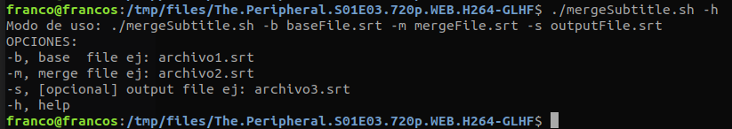
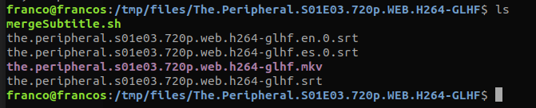

# merge Subtitle
### Combine two subtitles into a single file

Supported formats: srt, ass, ssa, vtt 

```
$ ./mergeSubtitle.sh -h
```


```
$ ./mergeSubtitle.sh -b the.peripheral.s01e03.720p.web.h264-glhf.en.0.srt -m the.peripheral.s01e03.720p.web.h264-glhf.es.0.srt -s the.peripheral.s01e03.720p.web.h264-glhf.srt
```



 


